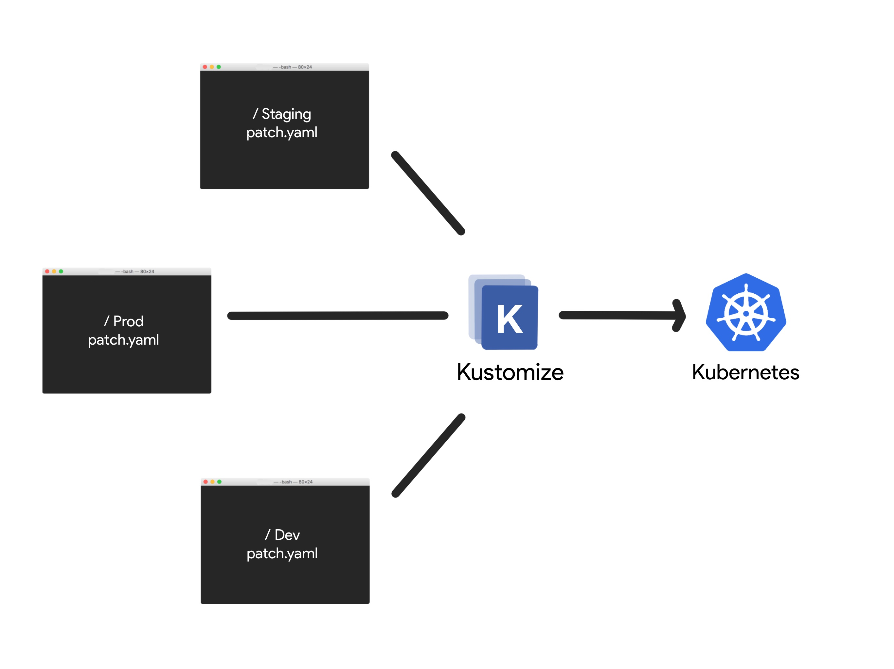

# Why Kustomize ?

Kustomize traverses a Kubernetes manifest to add, remove or update configuration options without forking. It is available both as a standalone binary and as a native feature of **kubectl**.

Kustomize lets you customize raw, template-free YAML files for multiple purposes, leaving the original YAML untouched and usable as is.



Features
- Purely declarative approach to configuration customization
- Natively built into **kubectl**
- Manage an arbitrary number of distinctly customized Kubernetes configurations
- Available as a standalone binary for extension and integration into other services
- Every artifact that kustokize uses is plain YAML and can be validated and processed as such
- Kustomize encourages a fork/modify/rebase workflow

For example:
base -> nginx-deployemnt.yaml
```yaml
apiVersion: apps/v1
kind: Deployment
metadata:
    name: nginx-deployment
spec:
    replicas: 1
    selector:
        matchLables:
            componenet: nginx
    template:
        metadata:
            labels:
                componenet: nginx
        spec:
            container: 
                - name: nginx
                  image: nginx
```

overlays/dev.yaml
```yaml
spec:
    replicas: 1
```
overlays/stag.yaml
```yaml
spec:
    replicas: 2
```
overlays/prod.yaml
```yaml
spec:
    replicas: 5
```

### Folder Structure:
k8s/

    base/            ---> Share or default configs across all environments
        kustomization.yaml
        nginx-deployment.yaml
        service.yaml
        redis-deployement.yaml
    overlays/        ---> Environment specific configurations that add or modify the base configs
        dev/
            kustomization.yaml
            config-map.yaml
        stag/
            kustomization.yaml
            config-map.yaml
        prod/
            kustomization.yaml
            config-map.yaml

## Kustomize vs Helm
Helm makes use of go templates to allow assigning variables to properties.

k8s/

    environments/                   
        values.dev.yaml
        values.stag.yaml
        values.prod.yaml
    templates/      
        nginx-deployment.yaml
        nginx-service.yaml
        db-deployement.yaml
        db-service.yaml

- Helm is more than just a tool to customize configurations on a per environment basis. Helm is also a package manager for the app
- Helm provides extra features like conditionals, loops, functions, and hooks
- Helm templates are not valid YAML as they go templateing syntax
    - Complex templates become hard to read

### Kustomization.yaml
k8s/

    nginx-deployment.yaml
    nginx-service.yaml
    kustomization.yaml

Kustomization.yaml
```yaml
# kubernetes resources to be managed by kustimize
resources:
    - nginx-deployment.yaml
    - nginx-service.yaml
# Customizations that need to be made
commonLabels:
    company: Kodekloud
```

build: 
```$ kustomize build k8s/```

Summary
- Kustomize looks for a kustomization file which contains:
    - List of all the k8s manifests kustomize should manage
    - All of the customizations that should be applied
- The kustomize build command combines all the manifests and applies the defined transformations
- The kustomize build command does not apply/deploy the k8s resources to a cluster
    - The output needs to redirected to the **kubectl apply** command

Apply kustomize configs
```yaml 
$ kustomize build k8s/ | kubectl apply -f
$ kubectl apply -k k8s/ #---> apply natively using kubectl
```

Delete kustomize configs
```yaml 
$ kustomize build k8s/ | kubectl delete -f
$ kubectl delete -k k8s/ #---> apply natively using kubectl
```

apiversion & kind in Kustomization.yaml
```yaml
apiVersion: kustomize.config.k8s.io/v1beta1
kind: Kustomization
# kubernetes resources to be managed by kustimize
resources:
    - nginx-deployment.yaml
    - nginx-service.yaml
# Customizations that need to be made
commonLabels:
    company: Kodekloud
```

## Managing Directories

Q. Create a single kustomization.yaml file in the root of the k8s directory and import all resources defined for db, message-broker, nginx into it. Please ensure to apply the config after creating kustomization.yaml file.

k8s/

    db/db-config.yaml
```yaml
apiVersion: v1
kind: ConfigMap
metadata:
  name: db-credentials
data:
  username: "root"
  password: "example"
```
    db/db-depl.yaml
```yaml
apiVersion: apps/v1
kind: Deployment
metadata:
  name: db-deployment
spec:
  replicas: 1
  selector:
    matchLabels:
      component: db
  template:
    metadata:
      labels:
        component: db
    spec:
      containers:
        - name: mongo
          image: mongo
          env:
            - name: MONGO_INITDB_ROOT_USERNAME
              valueFrom:
                configMapKeyRef:
                  name: db-credentials
                  key: username
            - name: MONGO_INITDB_ROOT_PASSWORD
              valueFrom:
                configMapKeyRef:
                  name: db-credentials
                  key: username

```
    db/db-service.yaml
```yaml
apiVersion: v1
kind: Service
metadata:
  name: db-service
spec:
  selector:
    component: db-deployment
  ports:
    - protocol: "TCP"
      port: 27017
      targetPort: 27017
  type: NodePort

```
    message-broker/rabbitmq-config.yaml
```yaml
apiVersion: v1
kind: ConfigMap
metadata:
  name: redis-credentials
data:
  username: "redis"
  password: "password123"
```
message-broker/rabbitmq-depl.yaml
```yaml
apiVersion: apps/v1
kind: Deployment
metadata:
  name: rabbitmq-deployment
spec:
  replicas: 2
  selector:
    matchLabels:
      component: rabbitmq
  template:
    metadata:
      labels:
        component: rabbitmq
    spec:
      containers:
        - name: rabbitmq
          image: rabbitmq
```
message-broker/rabbitmq-service.yaml
```yaml
apiVersion: v1
kind: Service
metadata:
  name: rabbit-cluster-ip-service
spec:
  type: ClusterIP
  selector:
    component: redis
  ports:
    - port: 5672
      targetPort: 5672
```
    nginx/nginx-depl.yaml
```yaml
apiVersion: apps/v1
kind: Deployment
metadata:
  name: nginx-deployment
spec:
  replicas: 3
  selector:
    matchLabels:
      component: nginx
  template:
    metadata:
      labels:
        component: nginx
    spec:
      containers:
        - name: nginx
          image: nginx
```
    nginx/nginx-service.yaml
```yaml
apiVersion: v1
kind: Service
metadata:
  name: nginx-service
spec:
  selector:
    component: nginx
  ports:
    - protocol: "TCP"
      port: 80
      targetPort: 80
  type: NodePort
```


```yaml
apiVersion: kustomize.config.k8s.io/v1beta1
kind: Kustomization
resources:
  - db/db-config.yaml
  - db/db-depl.yaml
  - db/db-service.yaml
  - message-broker/rabbitmq-config.yaml
  - message-broker/rabbitmq-depl.yaml
  - message-broker/rabbitmq-service.yaml
  - nginx/nginx-depl.yaml
  - nginx/nginx-service.yaml

```

```yaml
$ kubectl apply -k k8s/
```

Q. Let's create a kustomization.yaml file in each of the subdirectories and import only the resources within that directory.

```yaml
apiVersion: kustomize.config.k8s.io/v1beta1
kind: Kustomization
resources:
  - db/
  - message-broker/
  - nginx/
```
```yaml
apiVersion: kustomize.config.k8s.io/v1beta1
kind: Kustomization
resources:
  - db-config.yaml
  - db-depl.yaml
  - db-service.yaml
```
```yaml
apiVersion: kustomize.config.k8s.io/v1beta1
kind: Kustomization
resources:
  - rabbitmq-config.yaml
  - rabbitmq-depl.yaml
  - rabbitmq-service.yaml
```
```yaml
apiVersion: kustomize.config.k8s.io/v1beta1
kind: Kustomization
resources:
  - nginx-depl.yaml
  - nginx-service.yaml
```


